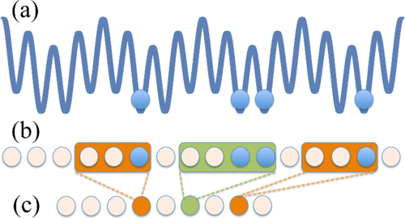
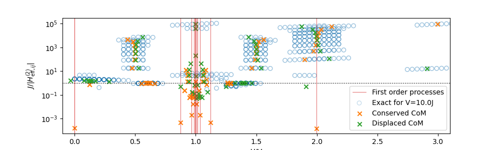
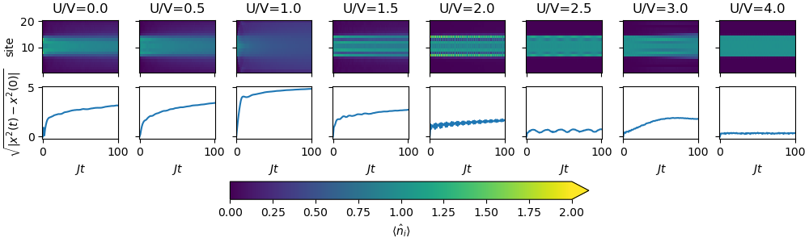
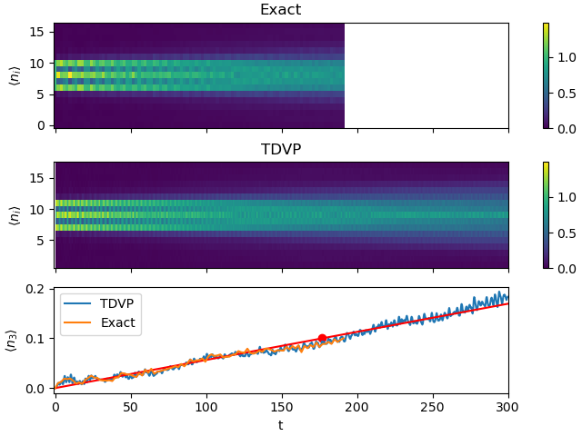

# Strict Conditions for Confinement in the extended Bose-Hubbard model
### April 2025
#### Tanausú Hernández-Yanes

---

## Extended Bose-Hubbard Hamiltonian

$$
\begin{align}
\hat{H} =& -J \sum_{j} (\hat{b}_{j+1}^\dagger \hat{b}_j +  \mathrm{h.c.}) \\
&+ \frac{U}{2} \sum_{j} \hat{n}_j(\hat{n}_j - 1) \\
&+ \sum_{i < j}^\text{cutoff} \frac{V_{ij}}{|i-j|^3}\hat{n}_i \hat{n}_j,
\end{align}
$$

---

## Initial assumptions about the model

- $J \ll U, V$
- $U \to \infty$

---

## Formation of inter-site bound clusters

[L. Barbiero et al, Out-of-equilibrium states and quasi-many-body localization in polar lattice gases, Phys. Rev. B 92, 180406(R) (2015)](dx.doi.org/10.1103/PhysRevB.92.180406)

---

## When is $U \to \infty$ reasonable?

[A. J. Daley et al, Repulsively Bound Atom Pairs: Overview, Simulations and Links, AIP Conf. Proc. 869, 212–218 (2006)](https://doi.org/10.1063/1.2400651)

[M. Valiente and D. Petrosyan, Scattering resonances and two-particle bound states of the extended Hubbard model, Journal of Physics B, Vol. 42 (2009)](https://doi.org/10.1088/0953-4075/42/12/121001)

---

## When is $U \to \infty$ reasonable?

---

## Resonant states

Can we find states of equal energy to that of a cluster?

---

## Resonant states

Values of $U$ where, at least, one resonant state exists at a given perturbation order (number of hops):

---

## Second-order processes

From cluster to another state in two hops

$$
\hat{H}_{\mathrm{eff},i\neq j}^{(2)} = \frac{1}{2}\sum_l \left(  \frac{\hat{V}_{il}\hat{V}_{lj}}{E_i - E_l} + \frac{\hat{V}_{jl}\hat{V}_{li}}{E_j - E_l} \right) 
$$

---

## Second-order processes

From cluster to another state in two hops

---

## Center of Mass Displacement

Examples of CoM conserving Fock states after two hops
$$\ket{\dots, 1, 0, 3, 0, 1, \dots}$$
$$\ket{2, 0, 1, \dots, 1, 0, 2}$$
$$\ket{1, 0, 1, \dots, 1, 0, 2}$$

---

## Center of Mass Displacement

---

## Expansion for different U/V

$V=10J, N = 8, M = 20$

---

## Is this applicable to other results?

---

## Quasi Many-Body Localization

$V = 50J$

[W. Li et al, Disorderless Quasi-localization of Polar Gases in One-Dimensional Lattices, PRL 124, 010404 (2020)](https://doi.org/10.1103/PhysRevLett.124.010404)

---

## Quasi Many-Body Localization

$V = 50J$

---

## Dimerization resuts

[L. Barbiero et al, Out-of-equilibrium states and quasi-many-body localization in polar lattice gases, Phys. Rev. B 92, 180406(R) (2015)](dx.doi.org/10.1103/PhysRevB.92.180406)

---

## Inhomogeneity and IPR

[L. Barbiero et al, Out-of-equilibrium states and quasi-many-body localization in polar lattice gases, Phys. Rev. B 92, 180406(R) (2015)](dx.doi.org/10.1103/PhysRevB.92.180406)

---

## Inhomogeneity and IPR

---

## Hilbert Space Shattering

[Wei-Han Li et al, Hilbert Space Shattering and Disorder-Free Localization in Polar Lattice Gases, PRL 127, 260601 (2021)](https://doi.org/10.1103/PhysRevLett.127.260601)

### TBD

---

## What happens to the expansion when we increase the number of particles?

---

## First passage test

---

## First passage

---

## Approximations with MPS

$N = 5, V = 10J, U = 17J, dt = 0.1/J$

---

## Truncation error

---

## First passage (with MPS)

---

## Expansion of 2x2 cluster
### Resonant states

Expansion can be anisotropic, depending on dipole polarization

<!--
-->

 

 

---

### Isotropic Expansion

$J = 1 Hz, V = 10 J, \theta= 0, \phi = 0$

 

---

### Ballistic expansion 

$J = 1 Hz, V = 31 J, \sin\theta= \sqrt{2/3}, \phi = \pi/4$

---

### Anisotropic Expansion

$J = 1 Hz, V = 50 J, \theta= 0.1982\pi, \phi = 0.7953\pi$

---

## $U < \infty$? 

Isotropic dipolar interactions

---

## Conclusions

- We require $U > 4V$ to see confinement-related phenomena at the second-order time scales
- Results like dimerization, quasi-localization, and Hilbert space shattering are affected
- 2D lattice can show anisotropic expansion rate at $U\to\infty$
- Results also dependent on finite U in a similar fashion

