## The Team

:::: {.columns}

::: {.column width='25%'}
{height="330px"}

:::

::: {.column width='25%'}
{height="330px"}

:::

::: {.column width='25%'}
{height="330px"}

:::

::: {.column width='25%'}
{height="330px"}

{height="60px"}
{style='filter: invert();'}
:::

::::

::: {.notes}
- Non-stabilizerness is an interesting new quantum resource that is receiving a lot of attention
- Implications on many-body systems relevant for quantum sensing
- One-axis twisting is a clean metrological protocol available in different platforms
:::

## Non-stabilizerness and Computing

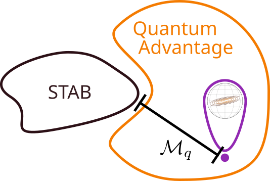{fig-align="center"}

A state can achieve quantum advantage only if it contains a sufficient amount of non-stabilizerness, measured by, for instance, the stabilizer Rényi entropy $\mathcal{M}_q$.

- Quantum error correction
- Fault-tolerant quantum computing

## Non-stabilizerness and Other Resources

- Entanglement-dominated states are *operationally* easier to manipulate than magic-dominated ones^[A. Gu et al, Magic-Induced Computational Separation in Entanglement Theory, [PRX Quantum 6 (2025)](https://journals.aps.org/prxquantum/abstract/10.1103/PRXQuantum.6.020324#abstract)]
- Stabilizer states are completely non-contextual^[M. Howard et al, Contextuality supplies the ‘magic’ for quantum computation, [Nature 510 (2014)](https://www.nature.com/articles/nature13460)]
- Quantum chaos is exponentially expensive for classical simulation based on stabilizer formalism^[L. Leone, Quantum Chaos is Quantum, [Quantum 5 (2021)](https://quantum-journal.org/papers/q-2021-05-04-453/)]

## Stabilizer States

- Construction analogous to classical linear codes
- Eigenstates of the tensor product of local Pauli operators with eigenvalue $+1$
( $\hat{P} \ket{\psi} = \ket{\psi}$, $\hat{P}$ stabilizes $\ket{\psi}$ )
- Highly entangled states can also be stabilizer states, see
$\hat{X}_1\hat{X}_2$ and $\hat{Z}_1\hat{Z}_2$ acting on
$\ket{\psi} = \frac{1}{\sqrt{2}}(\ket{00} + \ket{11})$

::: aside
M. A. Nielsen, I. L. Chuang,
Quantum Computation and Quantum Information,
[Cambridge Press (2010)](https://www.cambridge.org/highereducation/books/quantum-computation-and-quantum-information)
:::

::: {.notes}
- Many states are easier to describe through the operators that stabilize them
- Gottesman-Knill theorem: stabilizer states can be simulated classically in polynomial time
- One extra operation needed for universal set for quantum computation
:::

## The Stabilizer Polytope

::: {.notes}
For a single qubit, the polytope is defined by the convex mixture of its six Pauli eigenstates

$$\text{conv} \left\{\frac{1+\vec{a}\cdot\vec{\sigma}}{2}\right\}_{\vec{a}\in{\pm \vec{x}, \pm \vec{y}, \pm \vec{z}}} $$

Victor Veitch et al, Negative quasi-probability as a resource for quantum computation, [New J. Phys. 14 (2012)](https://iopscience.iop.org/article/10.1088/1367-2630/14/11/113011)

A. Oliveira et al,
:::

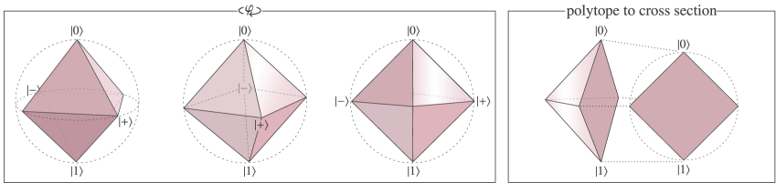

$$ \rho = \frac{1}{2}(1 + \vec{r}\cdot\vec{\sigma}) \rightarrow |r_x| + |r_y| + |r_z| \le 1 $$

$$
\mathcal{NS}(\rho) = \min_{\sigma\in\text{STAB}} \frac{1}{2}|| \rho - \sigma||_1
$$

::: aside
Trading athermality for nonstabiliserness,
[arXiv:2511.13839 (2025)](https://arxiv.org/abs/2511.13839v1)
:::

## Stabilizer measures

Relative entropy is a well defined monotone for any resource

$$ r_{\mathcal{M}} (\rho) = \min_{\sigma\in \text{STAB}} S(\rho || \sigma) $$

::: aside
Victor Veitch et al, The resource theory of stabilizer quantum computation, [New J. Phys. 16 (2014)](https://iopscience.iop.org/article/10.1088/1367-2630/16/1/013009)
:::

## Stabilizer measures

**Stabilizer Rényi Entropy (SRE)** is faithful, and does not require minimization

\begin{equation}
    \mathcal{M}_q(|\psi\rangle)=\frac{1}{1-q}\log_2\!\left(\frac{1}{2^N}\sum_{\hat{P}\in\mathcal{P}_N}\!\!\langle 
    \psi|\hat{P}| \psi \rangle^{2q}\right)
 \end{equation}

where $\hat{P}$ is a Pauli string, a tensor product of local Pauli operators and the identity.

::: {.notes}
- Monotone
- Non-negative
- Clifford invariant
- Additive on product states
:::

::: aside
 L. Leone, S. F. E. Oliviero, and A. Hamma, Stabilizer Rényi Entropy, [PRL 128 (2022)](https://doi.org/10.1103/PhysRevLett.128.050402)
:::

## SRE for the Permutation Invariant Sector

The computational complexity of the SRE is exponential, as we need to obtain $4^N$ expectation values.

Said complexity is reduced in the permutation invariant sector 
to polynomial^[ G. Passarelli, R. Fazio, and P. Lucignano, Nonstabilizerness of permutationally invariant systems, Physical Review A 110, [10.1103/physreva.110.022436](https://doi.org/10.1103/physreva.110.022436) (2024).], $\mathcal{O}(N^3)$.

. . .

**Can we do better?**

## Approximated SRE

\begin{equation}
	\lim_{N \to \infty} \mathcal{M}_q 
	\simeq \frac{1}{1-q}\log_2\left( \frac{1}{2}
    \sum_{\sigma\in \{X,Y,Z\}} 
    \sum_{n=1}^2
    \sum_{m=1}^2 
    \left(c_{n, m}^{(\sigma)}\right)^{2q} \right)
,\end{equation}

with coefficients 

$c^{(\sigma)}_{1,m} = |\bra{\sigma}\ket{\psi}|^2 + (-1)^m |\bra{-\sigma}\ket{\psi}|^2$, 
$c^{(\sigma)}_{2,m} = \sqrt{(-1)^m}(\bra{\psi}\ket{-\sigma}\bra{\sigma}\ket{\psi} +(-1)^m \bra{\psi}\ket{\sigma}\bra{-\sigma}\ket{\psi})$.

## Representation of $\hat{P}$ in SU(2)

A natural choice is to use the angular momentum eigenstates $\ket{J = N/2, m}$.

We choose instead the overcomplete basis of spin coherent states  

\begin{align}
\ket{\theta, \phi} =& \bigotimes_{j=1}^{2J} \left( \cos({\theta}/{2})\ket{0} + e^{-i\phi}\sin({\theta}/{2})\ket{1} \right) \\
=& \sum_{m=-J}^{J} \sqrt{2J \choose J+m} \cos^{J-m} \frac{\theta}{2} \left(\sin\frac{\theta}{2} e^{-i\phi}\right)^{J+m}\ket{J, m}
\end{align} 

## Representation of $\hat{P}$ in SU(2)

\begin{multline}
        \hat{\mathbb{I}}_{J}\hat{P}\hat{\mathbb{I}}_{J}
		= \left( \frac{2J+1}{4\pi} \right)^2 \int \int d\vb*{\Omega} d\vb*{\Omega'}
		 \ket{\theta, \phi} \bra{\theta', \phi'}
	\\
	%{ \cdot \bra{\theta, \phi} \hat{P} \ket{\theta', \phi'}}
	\class{fragment grow highlight-blue}{{} \cdot \bra{\theta, \phi} \hat{P} \ket{\theta', \phi'}}
\end{multline}

## Comparing SRE Scalings

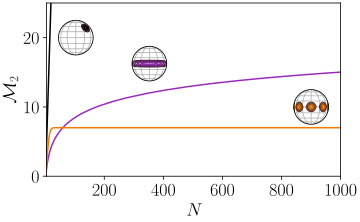

## Many-body Bell Correlations

\begin{equation}
    Q = \log_2(2^N {\mathcal E})<0,\quad
{\mathcal E}= \left|\frac{1}{N!}\ev{\left(\frac{\hat Y +i\hat Z}{2}\right)^N}\right|^2
\end{equation}

- $Q \leq 0$ for separable states
- $Q \geq N - k$ detects non-$k$-separability 
- $Q = N - 2$ for the GHZ state along x-axis

::: aside
M. Płodzień, M. Lewenstein, E. Witkowska, and J. Chwedeńczuk, One-axis twisting as a method of generating many-body bell correlations, Physical Review Letters 129, [10.1103/physrevlett.129.250402](https://doi.org/10.1103/physrevlett.129.250402) (2022)
:::

## One-Axis Twisting (OAT)

\begin{equation}
\ket{\psi(t)} = \exp\left\{-i \frac{\chi t}{4 \hbar}\hat{Z}^2 \right\} \ket{X},\quad \hat{Z} \equiv \sum_j \hat{Z}_j
\end{equation}

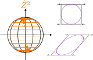{fig-align='center'}

$$
\xi^2 = N \frac{\min_{\vb*{n}} (\Delta \hat{\sigma}_{\perp, \vb*{n}}^2 )}{\ev*{\hat{X}}^2} \gtrsim N^{-2/3}
$$

## SRE at Squeezing Time Scale

$t \lesssim t_\mathrm{best}$

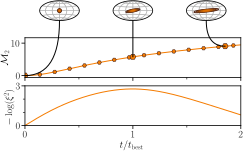

## $Q$ and SRE Scaling of Squeezed States

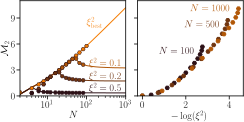

At $t_{\rm best}$ SRE scales with $\log_2(N)$, 
while $Q(t = t_\mathrm{best})  \approx N -  4 N^{1/3}$ 
(*anti-correlated*)

::: {.notes}
$4 \to a = \frac{\pi^2}{2} \log_2 e$
:::

## SRE of Kitten States

$\chi t \leq \frac{\pi}{2}$

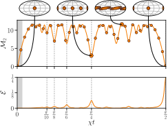

## $Q$ and SRE Scaling of Kitten States

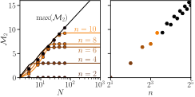

At large $N$ SRE is fixed, but scales with $\log_2(n)$, 
while $Q \simeq N-2\log_2(n)$ 
(*anti-correlated*)

# Conclusions

- Approximated stabilizer Rényi entropy (SRE) only requires six state projections
- For any system size $N$, fixing the squeezing level also fixes the SRE
- Correlation between SRE and squeezing parameter for best squeezing 

# Conclusions

- Anti-correlation between SRE and Bell correlations $Q$ for
  - Best squeezed states ($\mathcal{O}(\log_2(N))$, $\mathcal{o}(N)$)
  - Kitten states ($\mathcal{O}(1)$, $\mathcal{O}(N)$)

::: {style="color:grey;"}

Analytical results on Dicke states with $m=0$ and generalized GHZ states in the paper!

:::

# Thank You {background-video="SRE_Husimi_N100_q2.mp4" background-opacity="0.15"}

::: footer
Funding: National Science Centre, Poland, project 2021/03/Y/ST2/00186
:::

# Complementary Results

## Two-axis Counter-twisting (TACT)

\begin{equation}
\ket{\psi(t)} = \exp\left\{-i \frac{\chi t}{4 \hbar}(\hat{Z}\hat{Y} + \hat{Y}\hat{Z}) \right\} \ket{X}
\end{equation}

::: {layout-ncol=2}
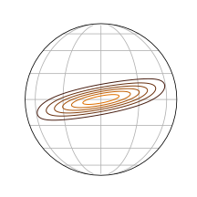

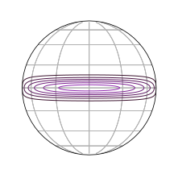
:::

## SRE of Squeezed States under TACT

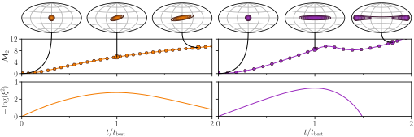

Same conclusions as OAT.

## SRE Scaling of Squeezed States under TACT

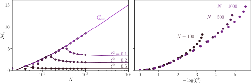

Same conclusions as OAT.

## Dicke States with Zero Magnetization

\begin{equation}
    \lim_{N\to\infty} \mathcal{M}_q(\ket{J = N/2, 0})
    \simeq  \frac{q}{q-1}\log_2\left(\frac{\pi N}{8}\right) - \frac{1}{q-1}
\end{equation}

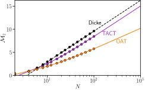

$$
Q \approx N - \log_2 N + \log_2 \frac{2}{\pi}
$$

## Generalized GHZ States
:::: {.columns}

::: {.column}

\begin{equation}
    \frac{1}{\sqrt{K}}\left( \ket{\theta=0, \phi=0} + \ket{\theta = 2\epsilon, \phi=0}
    \right)
\end{equation}

:::

::: {.column}
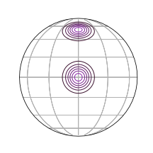{fig-align='right' height=180px}

:::

::::

::: aside
$K = 2(1 +\cos^{2J}\epsilon)$ 
:::

{fig-align='center'}

# Extra Slides

## Matrix elements of $\hat{P}$

\begin{equation}
	\bra{\theta_i, \phi_i}\hat{P}\ket{\theta_j, \phi_j} =
	(\alpha_{i,j})^{N_X} (\beta_{i,j})^{N_Y} (\gamma_{i,j})^{N_Z} (\kappa_{i,j})^{N_I}
,\end{equation}
where $N_\sigma$ denotes the number of distinct Pauli operators $\hat{\sigma}$ composing the Pauli string.

Implicit constraints:

$0 \le x \le 1,\quad \forall x \in \{|\alpha_{i,j}|^2, |\beta_{i,j}|^2, |\gamma_{i,j}|^2, |\kappa_{i,j}|^2\}$,

$|\alpha_{i,j}|^2 + |\beta_{i,j}|^2  + |\gamma_{i,j}|^2 + |\kappa_{i,j}|^2 = 2$.

## Feasible constraints on $\hat{P}$

$x_1, x_2, x_3, x_4 \in \mathcal{P}\{|\alpha_{i,j}|^2, |\beta_{i,j}|^2, |\gamma_{i,j}|^2, |\kappa_{i,j}|^2\}$

::: {.incremental}
- No constraints: complicated integral with no advantage over literature results.
- $x_1 = x_2 = 1$: **we only consider matrix elements independent of the system size $N$**.
- $x_1 = 1$: solvable through beta and gamma functions that yield expression (preliminary, unchecked) which only depends on $\ket{-Z} = \otimes_{j=1}^N \ket{0}$.
:::

## Approximated $\ev*{\hat{P}}$

\begin{equation}
        \ev*{\hat{P}}
        \simeq \sum_{\sigma \in \{X,Y,Z\}} \Bigg(
    	  c_{1,N_\sigma}^{(\sigma)} \bra{\sigma}\hat{P}\ket{\sigma} 
        + \frac{c_{2,N_{\overline{ \sigma}}}^{(\sigma)}}{\sqrt{(-1)^{N_{\overline{ \sigma}}}}} \bra{\sigma}\hat{P}\ket{-\sigma}
        \Bigg)
\end{equation}

## Approximated SRE

After some combinatorial calculations, we obtain

\begin{equation}
	\lim_{N \to \infty} \mathcal{M}_q
	\simeq \frac{1}{1-q}\log_2\left( \frac{1}{2}
    \sum_{\sigma\in \{X,Y,Z\}}
    \sum_{n=1}^2
    \sum_{m=1}^2
    \left(c_{n, m}^{(\sigma)}\right)^{2q} \right)
\end{equation}

## Husimi functions for OAT and $t < \pi / 2$

## $Q$ scaling for fixed squeezing level

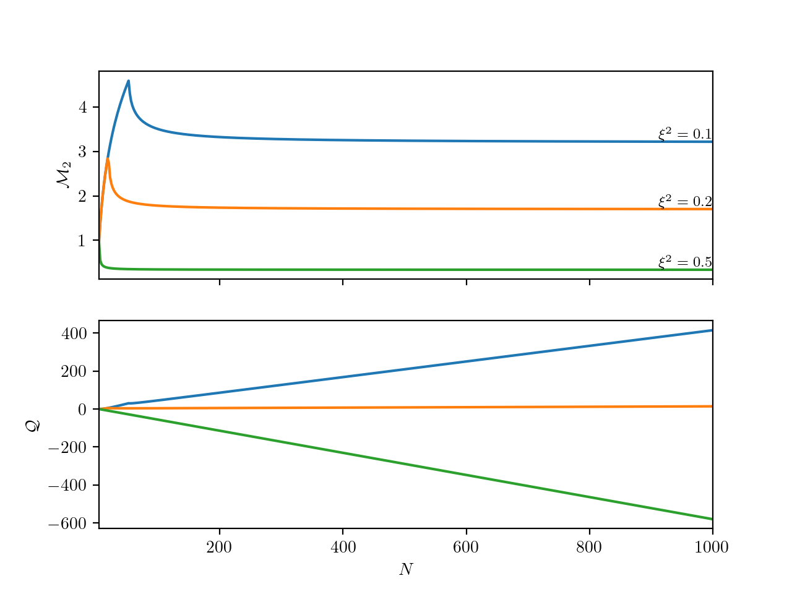{fig-align='center'}

## Coherence and SRE under OAT

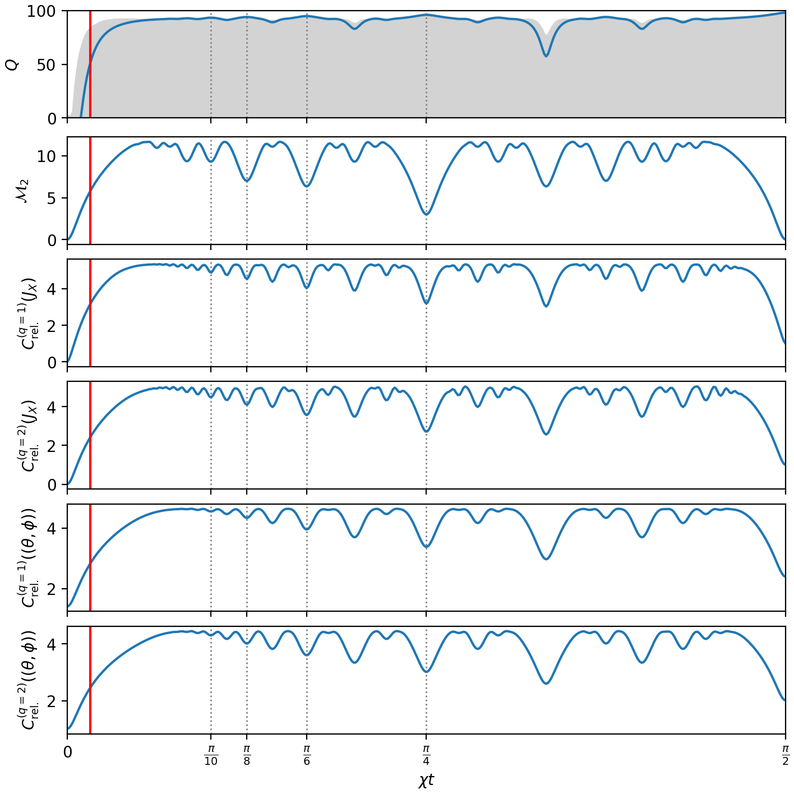

## Dicke states scaling

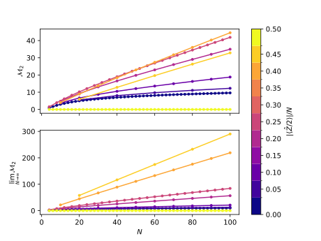{fig-align='center'}

## Corrections to the Approximated SRE

::: {layout-ncol=2}

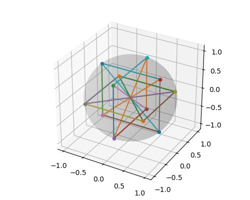

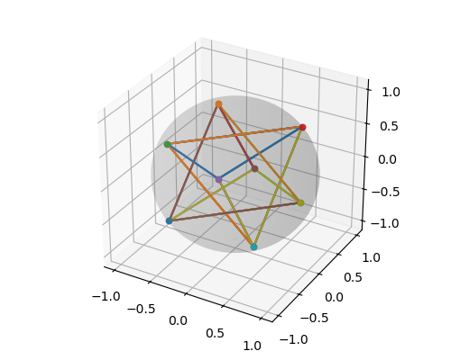

:::

## Example state: Generalized GHZ state

$$ \ket{\theta = 0, \phi = 0} + \ket{\theta = \pi/3, \phi = 0} $$

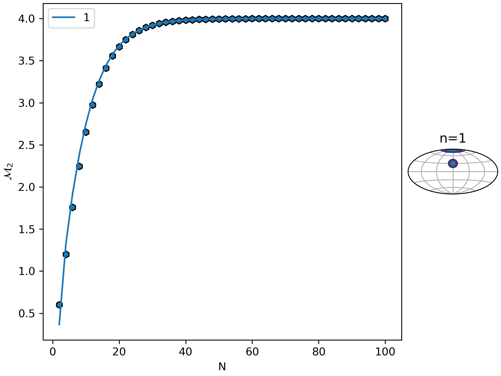{fig-align='center'}

## Pauli spectra of generalized GHZ state

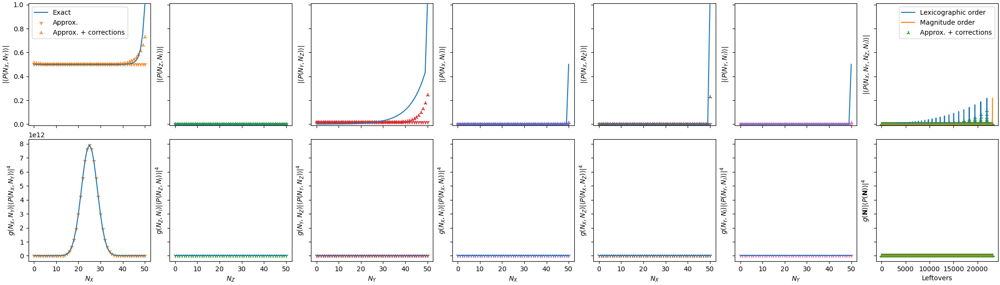

## Example state: Rotated coherent state

$$ \ket{\theta = \acos(3^{-1/2}), \phi = \pi/4} $$

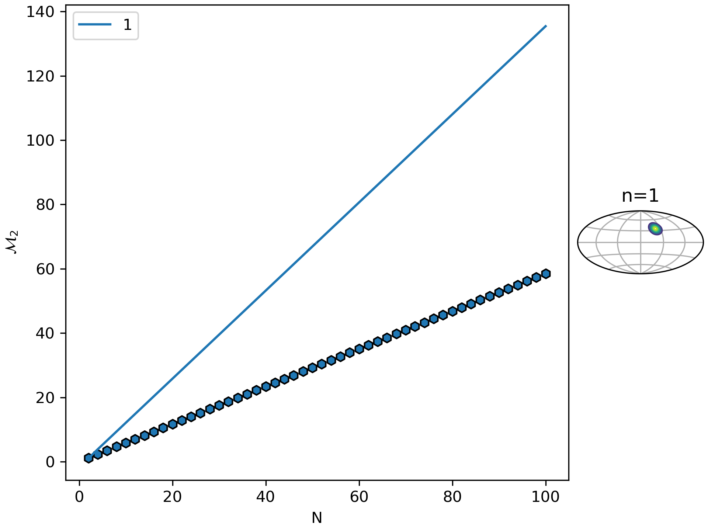{fig-align='center'}

## Pauli Spectra of rotated coherent state

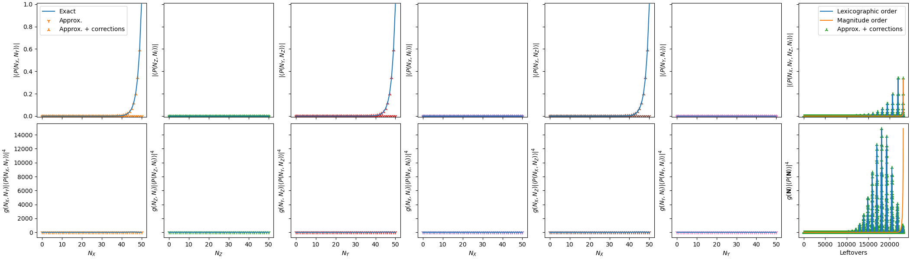

## Example state: Dicke state with magnetization $N/4$

$$\ket{J=N/2, m = N/4}$$

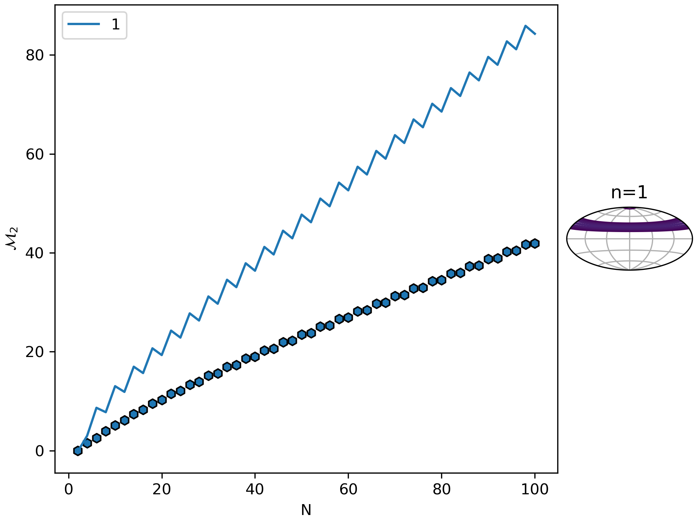{fig-align='center'}

## Pauli spectra of Dicke state with magnetization $N/4$

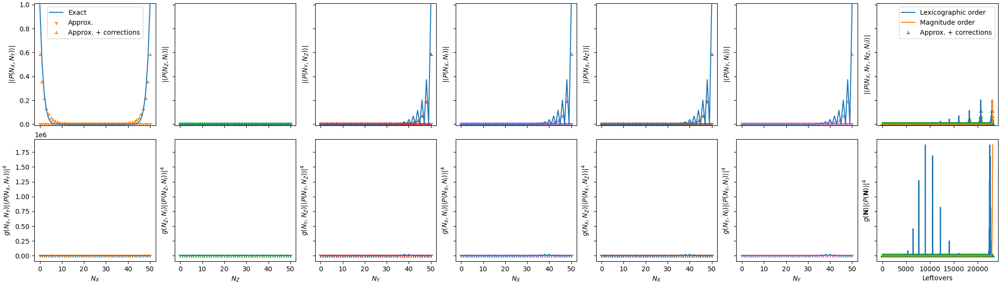

## Magic Resources for Fault-tolerant Quantum Computing

- Concatenation could outperform surface code
- No universal set of gates with transversal gates only 
- Non-transversal gates can be generated with non-stabilizer states and post-selection^[Victor Veitch et al, The resource theory of stabilizer quantum computation, [New J. Phys. 16 013009 (2014)](https://iopscience.iop.org/article/10.1088/1367-2630/16/1/013009)]
- Surprisingly cheap compared to other requirements^[M. Fellous-Asiani et al, Magic states are rarely the most important resource to optimize, [arXiv:2411.01880 (2024)](https://arxiv.org/abs/2411.01880)]

